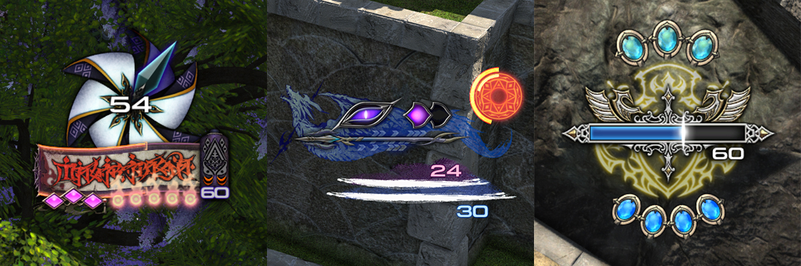

# Gauge-O-Matic

This plugin allows FFXIV players to track additional information on their job gauges, choosing from a variety of unique widget designs. All trackers & widgets can be toggled on/off at will, pinned to different parts of the HUD, and customized with unique options per design.

This plugin is a work in progress! There are still many more widget designs on the way, and presets for most jobs are still in a rough draft stage. If you have a request for an element that you'd like to see on your job's gauge, an idea for a widget/tweak, or if you've come up with a preset that you want to share, be sure to share your feedback in the repo's discussion section.

# Adding gauge elements
There are two ways to add elements to your job gauge: setting them up manually, or loading a preset.

## Adding elements manually

1. Click "Add"
2. Select a tracker to use. There are three categories:
    - **Status Effects** - Retrieves the time remaining or number of stacks.
    - **Actions** - Retrieves the cooldown time or the number of charges available.
    - **Job Gauge** - Retrieves unique data options per job gauge.
3. Select a Widget. Widgets fall into these categories:
    - **Counters** - Shows a count of stacks or charges
    - **Bars & Timers** - Shows a timer or resource value
    - **State Indicators** - Toggles between different visual states (usually on/off)
    - **Multi-Component** - These are groups of widgets designed to layer on top of each other, making one combined design.
4. Customize!

Each widget design has its own set of options to customize the way it looks and behaves. You can also choose which HUD element to pin each widget to, and control the order that widgets layer on top of each other.

## Using Presets

Upon opening the preset window, you'll be presented with a list of installed presets. Selecting any one of these will show you its contents. From there you can:
- Add elements from the preset individually
- Copy a design from the preset onto one of your existing trackers
- Add all elements at once
- Replace your job's current trackers with the contents of the preset.

> [!NOTE]
> If the preset contains trackers that are not applicable to the selected job, they'll be greyed out, but you can still use the widget designs.

## Saving Presets

You can save the trackers for your current job as a preset, or import a preset from elsewhere via the clipboard.

# Gauge Tweaks

There are a few options in place for customizing the appearance of the existing job gauges, rather than adding new elements to them. These are fairly limited for the time being, and most jobs only have the option to hide their gauges (allowing you to replace it with a different design, if you wish).
